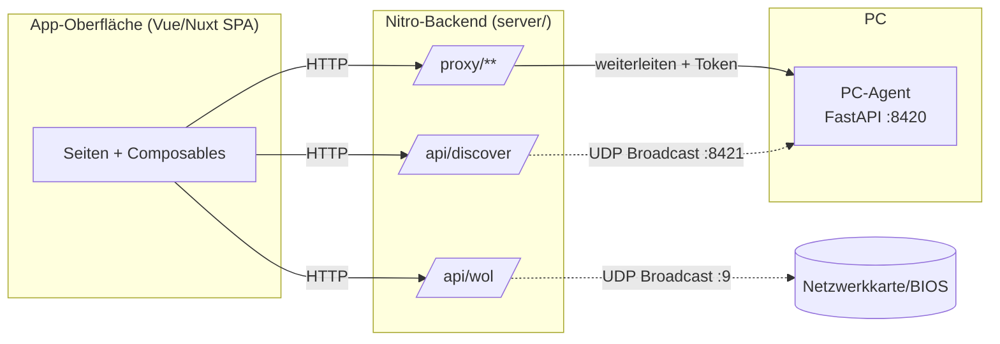
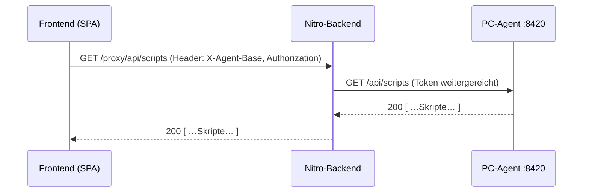
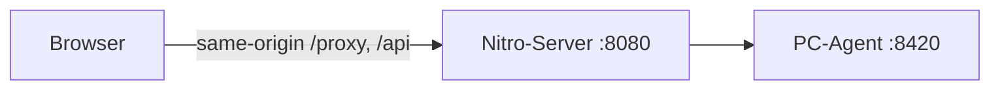
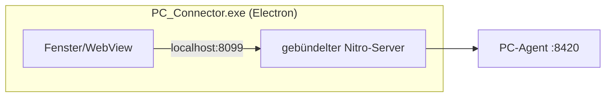
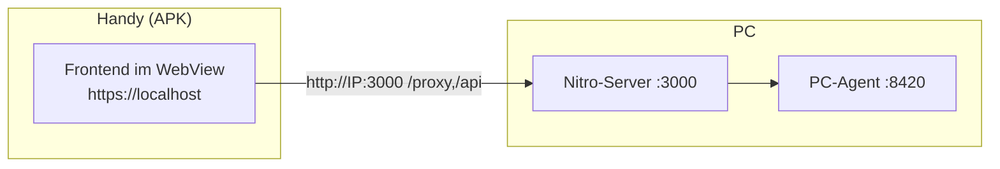

# PC Connector – Architektur & Zusammenspiel

Diese Datei erklärt, **wie die gesamte PC-Connector-App funktioniert** – vom
PC-Agent über den Nitro-Backend-Server bis zu den drei Auslieferungszielen
Web, Desktop (Electron) und Mobil (Capacitor).

---

## 1. Überblick in einem Satz

Ein kleiner **Agent** läuft auf dem PC und stellt eine REST-API bereit. Eine
**Vue/Nuxt-App** steuert diesen Agent. Weil ein Browser/Handy manche Dinge nicht
darf (rohe Netzwerkpakete, fremde Server ohne CORS), sitzt dazwischen ein
schlanker **Backend-Server** (Nitro), der genau diese Lücken schließt.



---

## 2. Die drei Bausteine

### 2.1 PC-Agent (`pc_agent/`) – Python + FastAPI

Der **kontrollierte** Teil. Läuft als `PC_Connector_Agent.exe` (oder
`python main.py`) auf dem Windows-PC und bietet:

| Bereich        | Endpunkte (Auszug)                                  |
| -------------- | --------------------------------------------------- |
| Pairing        | `POST /api/pair`                                    |
| Status         | `GET /api/status`                                   |
| Skripte        | `GET /api/scripts`, `POST /api/scripts/{id}/run`    |
| Abläufe        | `GET /api/chains`, `POST /api/chains/{id}/run`      |
| Eingabe        | `POST /api/input/mouse/*`, `/api/input/keyboard/*`  |
| Lautstärke     | `GET/POST /api/volume/*`                            |
| Zwischenablage | `GET/POST /api/clipboard/*`                         |
| Dateien        | `GET /api/files/list`, `upload`, `download`, `open` |
| Bildschirm     | `GET /api/screen/screenshot`                        |
| Verlauf        | `GET/DELETE /api/history/`                          |

Ports des Agents:

- **8420/TCP** – REST-API + eigene Weboberfläche
- **8421/UDP** – Discovery-Listener (antwortet auf den Suchruf `PCCONNECTOR_DISCOVER`)

Sicherheit: Beim Pairing erzeugt der Agent einen Einmalcode; die App tauscht ihn
gegen ein **Bearer-Token**, das jede weitere Anfrage autorisiert.

> Der Agent ist bewusst **unverändert** geblieben – die neue App ist ein reiner
> Ersatz für die alte Angular-Web-App und die Flutter-Handy-App.

### 2.2 Frontend (`web_app/pages`, `composables`) – Vue/Nuxt SPA

Die Oberfläche. Läuft als **Single Page App** (`ssr: false`), damit derselbe
Client-Build in den Browser, ins APK (Capacitor) und in Electron passt.

| Ordner         | Inhalt                                                                            |
| -------------- | --------------------------------------------------------------------------------- |
| `pages/`       | Datei-basiertes Routing: Geräteliste, Setup, Steuerung, …                         |
| `composables/` | `useApi` (alle Server-Aufrufe), `useProfiles`, `useTheme`, `useToast`, `useIcons` |
| `assets/css`   | globale Styles + Theme (Dark/Light über `.dark`-Klasse)                           |
| `types/`       | geteilte TypeScript-Modelle + Mapper                                              |

Wichtig: `useApi` baut jede URL als `${backendBase}${pfad}`. `backendBase` kommt
aus der Runtime-Config (`NUXT_PUBLIC_BACKEND_BASE`) und entscheidet, **wohin** die
Anfragen gehen (siehe Kapitel 4).

### 2.3 Backend (`web_app/server/`) – Nitro (Node)

Der „Backend-for-Frontend". Er ist **in Nuxt eingebaut** und übernimmt genau die
drei Dinge, die der Client selbst nicht kann:

| Route                        | Aufgabe                                                                                              |
| ---------------------------- | ---------------------------------------------------------------------------------------------------- |
| `server/routes/proxy/[...]`  | Reverse-Proxy an den PC-Agent – umgeht **CORS**, schleust das Bearer-Token für ``/Downloads ein |
| `server/api/wol.post.ts`     | sendet das **Wake-on-LAN** Magic Packet (UDP-Broadcast)                                              |
| `server/api/discover.get.ts` | **LAN-Discovery** per UDP-Broadcast auf Port 8421                                                    |
| `server/middleware/cors.ts`  | erlaubt Cross-Origin-Zugriffe der Capacitor-App                                                      |

---

## 3. Warum überhaupt ein Backend?

Ein Browser (und erst recht ein Handy-WebView) darf zwei Dinge grundsätzlich
nicht, die die App aber braucht:

1. **Rohe UDP-Pakete senden** → nötig für Wake-on-LAN und Netzwerk-Discovery.
2. **Fremde Server ohne CORS-Header aufrufen** → der PC-Agent schickt keine
   CORS-Header, ein direkter `fetch` würde vom Browser blockiert.

Deshalb ruft der Client **nie direkt** den Agent auf, sondern immer den
Nitro-Server. Der macht die UDP-Broadcasts selbst und leitet REST-Aufrufe per
`/proxy/**` an den Agent weiter (und hängt dabei den Bearer-Token an).



---

## 4. Das Zusammenspiel der drei Ziele

Der Clou: **Ein und derselbe Code** wird für drei Plattformen ausgeliefert. Der
einzige Unterschied ist, **wo der Nitro-Server läuft** und damit, welchen Wert
`backendBase` hat.

| Ziel        | Wie gebaut                  | Wo läuft der Nitro-Server?                | `backendBase`                                        |
| ----------- | --------------------------- | ----------------------------------------- | ---------------------------------------------------- |
| **Web**     | `nuxt build` (Docker)       | derselbe Server, der die Seite ausliefert | leer → **same-origin**                               |
| **Desktop** | `nuxt build` + Electron     | Electron startet ihn lokal (Port 8099)    | leer → **same-origin**                               |
| **Mobil**   | `nuxt generate` + Capacitor | **extern** auf einem PC (Web-Instanz)     | z. B. `http://192.168.x.x:3000` (im APK eingebacken) |

### 4.1 Web (Nuxt + Docker)



Der Nitro-Server liefert **sowohl** das Frontend **als auch** die API aus. Kein
`backendBase` nötig. Deployment via `docker compose up` (mit `network_mode: host`,
damit UDP-Broadcasts das LAN erreichen).

### 4.2 Desktop (Electron)



`electron/main.cjs` startet im Produktionsmodus den mitgelieferten Nitro-Server
(Port 8099) als eigenen Node-Prozess und lädt die App von dort. Dadurch bringt
die Desktop-App **alles selbst mit** – Proxy, WOL, Discovery – ohne externe
Abhängigkeit. `backendBase` bleibt leer (same-origin).

### 4.3 Mobil (Capacitor – Android/iOS)



Das **Frontend ist fest ins APK eingebacken** (durch `nuxt generate`; Capacitor
kopiert es in das native Projekt). Das Handy kann WOL/Discovery **nicht selbst** –
darum zeigt es über `NUXT_PUBLIC_BACKEND_BASE` auf eine laufende Web-Instanz auf
dem PC. Der PC macht dann die Broadcasts.

Drei Hürden, die es dabei nur auf dem Handy gibt (auf dem Web nicht, weil dort
same-origin):

| Hürde                      | Lösung                                                             |
| -------------------------- | ------------------------------------------------------------------ |
| Klartext-HTTP blockiert    | `usesCleartextTraffic="true"` (Manifest) + `server.cleartext`      |
| Mixed Content (https→http) | `android.allowMixedContent: true` (Capacitor)                      |
| CORS (cross-origin)        | `server/middleware/cors.ts` setzt `Access-Control-Allow-Origin: *` |

Emulator-Besonderheit: `10.0.2.2` ist im Android-Emulator ein Alias auf die
**IPv4-Loopback des PCs**. Deshalb muss der Dev-Server auf `0.0.0.0` lauschen
(`nuxt dev --host 0.0.0.0`).

---

## 5. Ports auf einen Blick

| Port     | Wer                        | Zweck                                   |
| -------- | -------------------------- | --------------------------------------- |
| 8420/TCP | PC-Agent                   | REST-API + Agent-Weboberfläche          |
| 8421/UDP | PC-Agent                   | Discovery-Listener                      |
| 9/UDP    | (Zielport WOL)             | Wake-on-LAN Magic Packet                |
| 3000/TCP | Nitro-Dev-Server           | `npm run dev` (Web + Mobil-Backend)     |
| 8080/TCP | Nitro-Server (Docker)      | Web-Deployment                          |
| 8099/TCP | Nitro-Server (in Electron) | interner Backend-Server der Desktop-App |

---

## 6. Verzeichnisstruktur (`web_app/`)

```
web_app/
├─ nuxt.config.ts          # SSR aus, appManifest aus, runtimeConfig(backendBase)
├─ app.vue                 # Root: Theme-Init + globaler Toast
├─ pages/                  # Routing
│  ├─ index.vue            # Geräteliste (+ Discovery, WOL, Entfernen)
│  ├─ setup.vue            # PC hinzufügen / Pairing
│  └─ pc/[id]/             # index (Steuerung), input, files, screen, history
├─ composables/
│  ├─ useApi.ts            # ALLE Server-/Agent-Aufrufe (nutzt backendBase)
│  ├─ useProfiles.ts       # gekoppelte PCs (localStorage)
│  ├─ useTheme.ts          # Dark/Light
│  ├─ useToast.ts          # Snackbar
│  └─ useIcons.ts          # Material-Icon-Name → Emoji
├─ server/
│  ├─ routes/proxy/[...].ts# Reverse-Proxy an den Agent (httpxy)
│  ├─ api/wol.post.ts      # Wake-on-LAN
│  ├─ api/discover.get.ts  # LAN-Discovery
│  └─ middleware/cors.ts   # CORS für die Capacitor-App
├─ electron/               # main.cjs (startet Nitro), preload.cjs
├─ capacitor.config.ts     # webDir=.output/public, cleartext, allowMixedContent
├─ Dockerfile / docker-compose.yml
└─ scripts/build-all.mjs   # Android + iOS + Desktop in einem Lauf
```

---

## 7. Wichtige Abläufe im Detail

### 7.1 PC koppeln (Pairing)

1. Am PC in der Agent-Weboberfläche **„Code generieren"**.
2. In der App unter _Setup_ IP, Port und Code eingeben.
3. `useApi.pair()` → `POST /proxy/api/pair` (Header `X-Agent-Base` = Agent-URL).
4. Der Agent gibt bei Erfolg ein **Token** (+ MAC + PC-Name) zurück.
5. Das Profil wird in `localStorage` gespeichert (`useProfiles`).

### 7.2 PCs im Netzwerk finden (Discovery)

1. `useApi.discover()` → `GET /api/discover` am Nitro-Server.
2. Der Server sendet `PCCONNECTOR_DISCOVER` als UDP-Broadcast auf `:8421`.
3. Alle Agents im LAN antworten mit Name/IP/Port/MAC.
4. Der Server sammelt 3 s lang und gibt die Liste zurück.

### 7.3 PC aufwecken (Wake-on-LAN)

1. `useApi.wol(mac)` → `POST /api/wol`.
2. Der Server baut das Magic Packet und broadcastet es (UDP).
3. Die im BIOS/NIC aktivierte WOL-Funktion weckt den PC.

### 7.4 Skript ausführen / Maus / Dateien / Screen

Alle laufen nach demselben Muster über `/proxy/**`:
`Frontend → Nitro-Proxy (+Token) → Agent :8420 → Antwort zurück`.
Der Live-Bildschirm ist reines Polling von JPEG-Screenshots
(`/api/screen/screenshot`), Downloads/`` tragen Token & Agent-Basis als
Query-Parameter (`__token`, `__base`), die der Proxy in Header übersetzt.

---

## 8. Konfiguration

| Variable / Flag             | Wo                     | Wirkung                                             |
| --------------------------- | ---------------------- | --------------------------------------------------- |
| `NUXT_PUBLIC_BACKEND_BASE`  | Build-Zeit (nur Mobil) | Zieladresse des Backends, **fest ins APK gebacken** |
| `PORT`                      | Laufzeit (Web/Docker)  | Port des Nitro-Servers                              |
| `PC_CONNECTOR_PORT`         | Electron               | interner Server-Port (Standard 8099)                |
| `server.cleartext`          | capacitor.config       | erlaubt Klartext-HTTP auf Android                   |
| `android.allowMixedContent` | capacitor.config       | erlaubt https-Seite → http-Anfrage                  |

> **Goldene Regel:** `NUXT_PUBLIC_BACKEND_BASE` **nur** beim APK-Build setzen,
> **nie** bei `npm run dev` – sonst schickt auch die Website ihre Anfragen an die
> Handy-Adresse ins Leere.

---

## 9. Bauen & Starten (Kurzform)

| Zweck                                | Befehl (in `web_app/`)                                             |
| ------------------------------------ | ------------------------------------------------------------------ |
| Alles zum Testen (Web+Desktop)       | `start_all.bat` (Repo-Root)                                        |
| Nur Dev-Server (Web + Mobil-Backend) | `npm run dev`                                                      |
| Desktop starten                      | `npm run build` + `npx electron .`                                 |
| Desktop-Installer (EXE)              | `npm run build:desktop` → `web_app/release/`                       |
| Android-APK bauen                    | `NUXT_PUBLIC_BACKEND_BASE=http://<PC-IP>:3000 npm run cap:android` |
| Alles bauen (Android+iOS+EXE)        | `build_all.bat` bzw. `npm run build:all`                           |

> **Wichtig:** `nuxt generate`/`nuxt build` nie parallel zu `npm run dev`
> ausführen (gemeinsamer `.nuxt`-Cache → kaputter Build).

---

## 10. Sicherheit

- Der Proxy leitet an eine **vom Client angegebene** Agent-Adresse weiter. Im
  vertrauenswürdigen Heimnetz ok – **nicht** ungeschützt ins Internet stellen
  (SSRF-Risiko). Bei Bedarf Reverse-Proxy mit Auth davor.
- Pairing stellt sicher, dass nur gekoppelte Geräte Befehle senden; Tokens liegen
  lokal und sind ohne Netzwerkzugang wertlos.
- Wake-on-LAN funktioniert nur bei Broadcast-Erreichbarkeit (gleiches Subnetz,
  WOL im BIOS/NIC aktiv).
