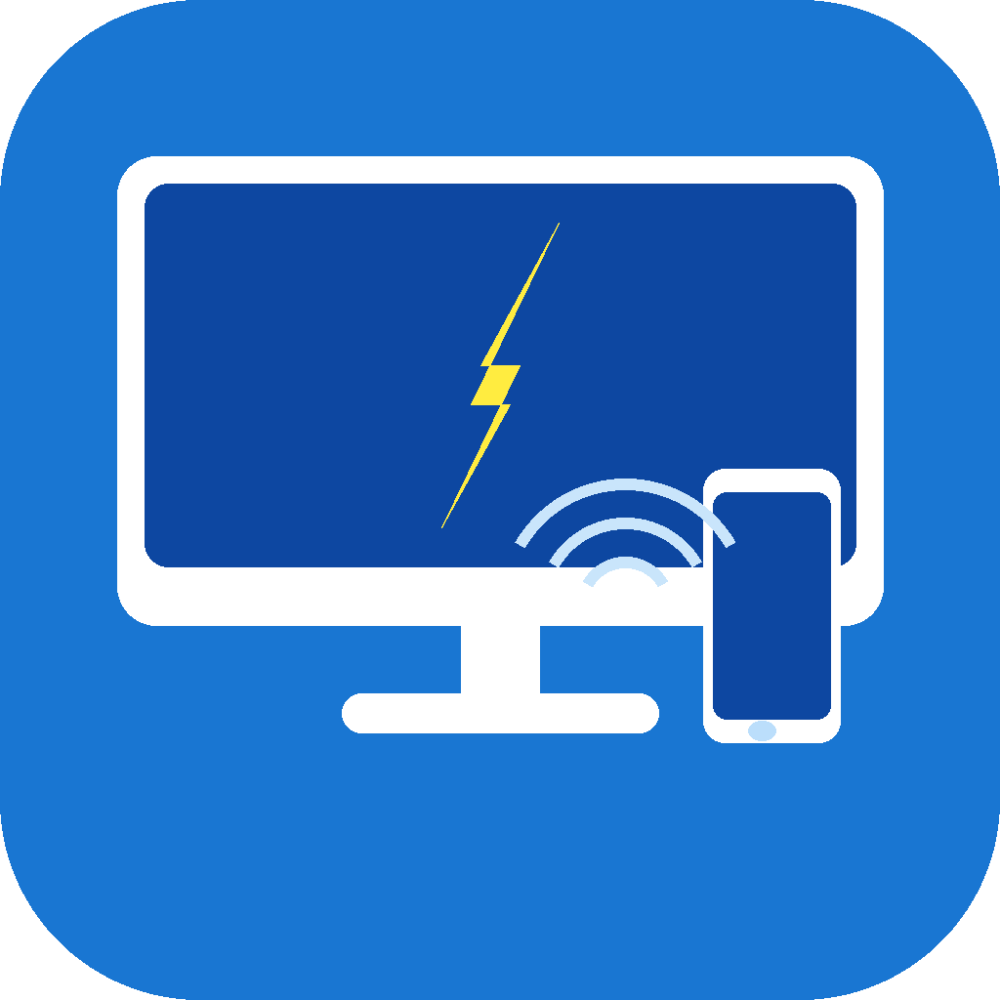

<p align="center">
  
</p>

<h1 align="center">PC Connector</h1>

<p align="center">
  Steuere und wecke deinen PC vom Handy aus – per Wake-on-LAN, Skripte und Abläufe.
</p>

<p align="center">
  <a href="../../releases/latest">
    
  </a>
  &nbsp;
  
  &nbsp;
  
</p>

---

## Was ist PC Connector?

PC Connector ermöglicht es, einen Windows-PC bequem vom Smartphone aus zu steuern – ohne Cloud, ohne Konto, vollständig im eigenen Heimnetzwerk.

Ein kleiner Server (`PC_Connector_Agent.exe`) läuft auf dem PC im Hintergrund. Die Android-App verbindet sich per einmaligem Pairing-Code sicher damit und erlaubt anschließend das Ausführen von Skripten, das Steuern des PCs über vorgefertigte Abläufe und das Aufwecken aus dem Ruhezustand per Wake-on-LAN.

### Komponenten

| Komponente | Technologie | Beschreibung |
|---|---|---|
| **PC Agent** | Python + FastAPI | Server-Prozess auf dem PC, stellt REST-API + Weboberfläche bereit |
| **Android App** | Flutter | Smartphone-App zur Steuerung |

---

## Features

### Kostenlos

| Feature | Beschreibung |
|---|---|
| ⚡ **Wake-on-LAN** | PC aus dem Schlaf aufwecken, auch wenn er ausgeschaltet ist |
| 📡 **Automatische Erkennung** | App findet den PC automatisch im lokalen Netzwerk (UDP-Broadcast) |
| 🔒 **Sicheres Pairing** | Einmaliger Code – kein Passwort im Klartext |
| ▶ **Skripte ausführen** | Bis zu 3 Windows-Befehle per Knopfdruck starten |
| 🖱️ **Maus & Tastatur** | PC-Maus und Tastatur vom Handy aus fernsteuern |
| 🔊 **Lautstärke-Regler** | Schieberegler für PC-Lautstärke direkt aus der App |
| 📋 **Zwischenablage senden** | Text vom Handy in die PC-Zwischenablage übertragen |
| 🌐 **Weboberfläche** | Vollständige Konfiguration im Browser, kein App-Update nötig |
| 🌙 **Dark/Light Mode** | App-Theme frei wählbar |

### Pro (3 €/Monat)

| Feature | Beschreibung |
|---|---|
| ∞ **Unbegrenzte Skripte** | Mehr als 3 Skripte anlegen und ausführen |
| 🔗 **Abläufe / Script-Chains** | Mehrschrittige Automatisierungen mit Verzögerungen |
| 📁 **Gruppen & Kategorien** | Skripte organisieren und per Drag & Drop sortieren |
| 🖥️ **Mehrere PC-Profile** | Mehrere PCs in der App verwalten |
| 🖼️ **Bildschirmübertragung** | PC-Bildschirm live auf dem Handy anzeigen (readonly) |
| 📂 **Datei-Explorer** | Dateistruktur des PCs durchsuchen, Dateien hoch- und herunterladen |
| 📜 **Skript-Verlauf** | Log aller ausgeführten Skripte mit Ergebnis |
| 🔐 **PIN-Sperre** | App per PIN absichern |

---

## Screenshots

> *Screenshots folgen in einer späteren Version.*

---

## Download

Den neuesten Release findest du unter [**Releases**](../../releases/latest):

| Datei | Für wen | Größe ca. |
|---|---|---|
| `PC_Connector_Agent.exe` | PC (Windows 10/11) – kein Python nötig | ~17 MB |
| `app-arm64-v8a-release.apk` | Android (moderne Geräte, z.B. Pixel, Samsung S-Serie) | ~17 MB |

---

## Installation

### PC Agent (Windows)

**Schritt 1 – Wake-on-LAN im BIOS aktivieren**  
Im BIOS/UEFI unter „Power Management" → „Wake on LAN" oder „PCI-E Power On" aktivieren.

**Schritt 2 – Netzwerkkarte konfigurieren**  
Geräte-Manager → Netzwerkkarte → Eigenschaften → Energieverwaltung → „Gerät kann den Computer aus dem Ruhezustand aktivieren" ankreuzen.
Geräte-Manager → Netzwerkkarte → Eigenschaften → Erweitert -> „Wake on Magic Packet" auf „Enabled" setzen.

3. `PC_Connector_Agent.exe` auf dem PC herunterladen und starten.

4. Weboberfläche unter im Browser unter `http://localhost:8420` öffnen oder per Rechtsklick auf das Icon in der Taskleiste im System-Tray und „Website öffnen" auswählen.

5. Auf „Code generieren" klicken.

---

### Android App

1. `app-arm64-v8a-release.apk` auf dem Handy herunterladen.
2. Vor der Installation: **Einstellungen → Sicherheit → Aus unbekannten Quellen installieren** aktivieren
3. APK antippen und installieren
4. App starten -> Gerät hinzufügen -> Namen und den Code auf der Website eingeben -> Verbinden.

---

## Weboberfläche

Erreichbar unter `localhost`.

| Bereich | Funktion |
|---|---|
| **Gerätekopplung** | Pairing-Codes generieren, verbundene Geräte anzeigen und entfernen |
| **Skripte** | Skripte anlegen, bearbeiten, Gruppe zuweisen, per Drag & Drop sortieren |
| **Abläufe** | Mehrschrittige Abläufe mit Verzögerungen konfigurieren |
| **Gruppen** | Kategorien anlegen und Skripte zuweisen |

---

## Skript-Beispiele

```yaml
# Herunterfahren
command: shutdown /s /t 0

# Neu starten
command: shutdown /r /t 0

# PC sperren
command: rundll32.exe user32.dll,LockWorkStation

# Steam starten
command: start steam://open/main

# Lautstärke stummschalten
command: powershell -c "(New-Object -ComObject WScript.Shell).SendKeys([char]173)"
```

---

## Selbst bauen

### Voraussetzungen

- Python 3.12+
- Flutter 3.x (SDK)
- Android SDK + JDK 17

### PC Agent EXE

```bat
build_agent.bat
```

Ausgabe: `pc_agent\dist\PC_Connector_Agent.exe`

### Android APK

```bat
build_apk.bat
```

Ausgabe: `mobile_app\build\app\outputs\flutter-apk\`

---

## Sicherheitshinweis

PC Connector ist für den Einsatz im **lokalen Heimnetzwerk** ausgelegt.

- Port `8420` **nicht** über das Internet freigeben (keine Port-Weiterleitung im Router)
- Das Pairing-System stellt sicher, dass nur explizit gekoppelte Geräte Befehle senden dürfen
- Tokens werden lokal gespeichert und sind ohne Netzwerkzugang wertlos

---

## Lizenz

MIT License – Copyright (c) 2026 Hannes Jütting – siehe [LICENSE](LICENSE)

